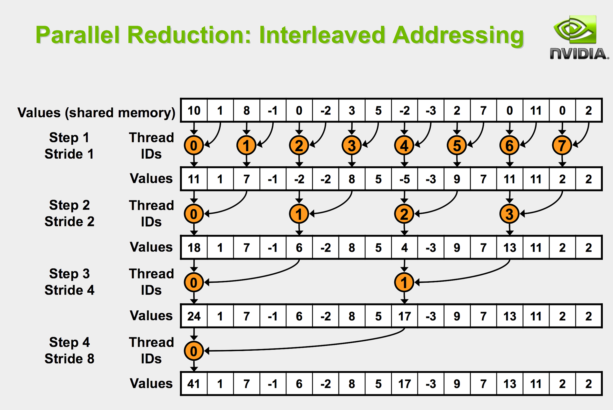
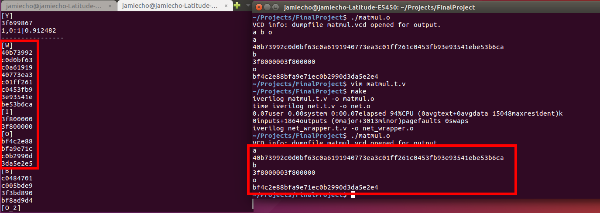
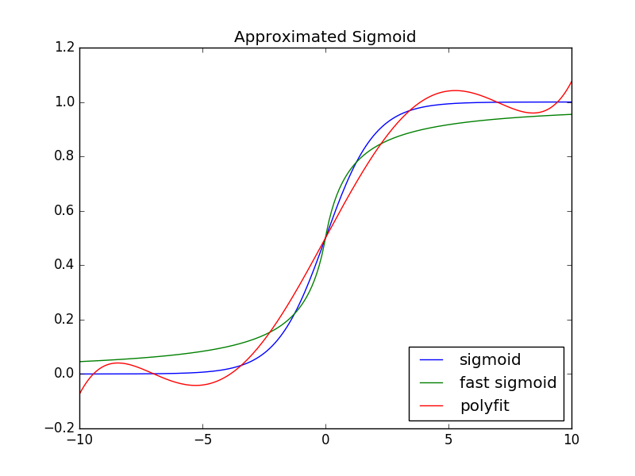
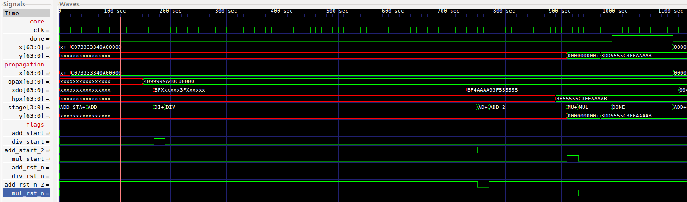
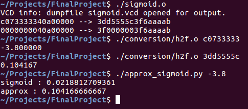
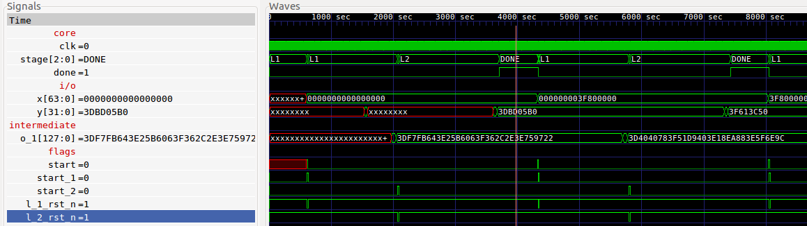
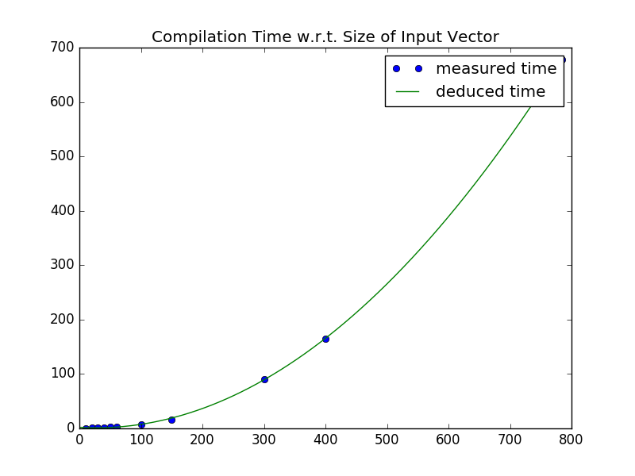

## Links

- [Proposal](https://docs.google.com/document/d/1ULqsxGpxzVEamMZO5F3Pto4A9VCm7r37K5DoMaEWpnU/edit?usp=sharing)
- [Demo Video](http://www.youtube.com)

### What did I do?

I implemented a generic feed-forward [Artificial Neural Network](https://en.wikipedia.org/wiki/Artificial_neural_network) in verilog.

### Why did I do it?

The operations that govern a neural network are, by nature, heavily parallel, whereas a CPU is mostly sequential - even for ones with multiple cores. Modern machine-learning architectures take advantage of the massively parallel processing power of the GPU to accelerate the training and computing process, but [recent benchmarks](https://liu.diva-portal.org/smash/get/diva2:930724/FULLTEXT01.pdf) show that as more parallelism is required, smaller scale, breadth-centric computing devices such as FPGAs can outperform GPUs; indeed, unlike GPUs that require external computing interfaces, FPGAs can be a efficient and independent alternative to the task of training the neural network and computing predictions. Although I was unaware of this at the time, Microsoft has announced a [similar push](https://www.top500.org/news/microsoft-goes-all-in-for-fpgas-to-build-out-cloud-based-ai/) towards using FPGAs in the field of Artificial Intelligence.

### How did I do this?

In order to understand the process, a bit of background in the field is necessary.

A Neural Network is a recent advance in computer science, inspired by biological interaction of neurons, that simulate the procedure of thought and training via enhancing the activation of a neuron *responsible* for a certain output. These neurons act in parallel to form a layer which, when stacked together, ultimately construct a *Deep Neural Network* that can act as highly intelligent function approximators, even for non-linear functions.

Since the input to each neuron, except the direct input layer, is a sum of activations from the connected neurons from the previous layer, the procedure can be encapsuled into a simple matrix multiplication:

$$
\begin{equation*}
\vec{i_i} = W_i\vec{o_{i-1}} + \vec{b_i} \\
\end{equation*}
$$

Where W, i, b, o are weights, input, bias, and output, respectively, and subscript i indicates the index.

#### Matrix Multiplication

Now, in implementation, Matrix Multiplication implements the following equation for each element of O, where O=AB:

$$
\begin{align*}
O_{i,j} = \sum_{n=0}^{C} A_{i,n}B_{n,j}
\end{align*}
$$

But since this is not an atomic operation, the intermediate array $$A_{i,n}B_{n,j}$$ for $$n \in [0 ... N-1]$$ must be stored. This is where the procedure needs to be split into multiplication and reduction phases.

The multiplication phase is self-evident, so it will not be explained in detail; the reduction -- specifically, accumulation -- may benefit from a more detailed description, as it is not immediately obvious.

Whereas the most intuitive reduction operation would be a sequential one, where

$$
Y = A + (B + (C + (D + ...)))
$$

it is clear that this is essentially sequential; it is inefficient and slow, with time complexity of O(N). A better arrangement would be:

$$
Y = ((A+B) + (C+D)) + ...
$$

which is O(log(N)). Perhaps a figure would best illustrate this:



Since I had some background in CUDA, this was similarly derived from the common paradigm in parallel computing for a GPU.

The following [figure](images/matmul.png) verifies, in hexadecimal representation, that the matrix multiplication module works as intended.:



It is apparent that W,I,O on the left corresponds to a,b, and o on the right, respectively.

(Relevant scripts are [matmul.v](https://github.com/yycho0108/FinalProject/blob/master/matmul.v) and [matmul.t.v](https://github.com/yycho0108/FinalProject/blob/master/matmul.t.v).)

#### Activation

After the inputs to the neurons are computed, they undergo what is called the **activation**. 

$$
\begin{equation*}
\vec{o_i} = f(\vec{i_i})
\end{equation*}
$$

This is essentially analogous to amplifying the signal strength such that stronger inputs result in a stronger output. Here, f is any **differentiable, non-linear** activation function; to name a few, hyperbolic tangent, sigmoid, linear or rectified linear functions are classic examples.
it is crucial that f be differentiable, as its derivative is used in the back-propagation process, and the non-linearity of the activation allows for the network to approximate non-linear functions, in a similar fashion to that of the [Extended Kalman Filter](https://en.wikipedia.org/wiki/Extended_Kalman_filter).

Due to the limitation of the used FPU, i.e. lacking the exponential function, it was not feasible to achieve true sigmoid function, given by:

$$
\begin{equation*}
f(x) = \frac{1}{1 + e^{-x}}
\end{equation*}
$$

thus, I had to use a simpler version:

$$
\begin{equation*}
f(x) = \frac{1}{2}(1 + \frac{x}{1+|x|})
\end{equation*}
$$

This only comprises addition, division, multiplication and the absoulte-value functions, and as a result may be faster in practical applications.

The function values are reasonably close within small ranges:



To verify the results, run [approx_sigmoid.py](https://github.com/yycho0108/FinalProject/blob/master/approx_sigmoid.py).

In verilog, the waveform obtained from the [test bench](https://github.com/yycho0108/FinalProject/blob/master/sigmoid.t.v) should suffice to demonstrate that the sigmoid module works as intended.



If the image is too small, please click on [this link](images/sigmoid-wave.png) or right-click the image and open it in a new tab.

For those, including myself, for whom hexadecimal representations of floating point numbers don't immediately make sense, there is a [convenience script](https://github.com/yycho0108/FinalProject/blob/master/conversion/h2f.cpp) under *conversion* that converts hexadecimal to float, and vice versa. Accordingly, here is an example of running the procedure:



It should be noted that the resulting number is exactly the same; the number (c073333340a00000) is composed of 16 characters because it is a vector of two 32-bit floating-point elements in hexadecimal notation. As such, the sigmoid function applied to 40a00000 also produces 3f6aaaab.

As a quick aside, it should be noted that since the sigmoid function is relatively sensitive to small changes, the precomputed weights must also be trained with the same activation function; i.e. a sigmoid network and fast-sigmoid trained weights may not be compatible.

#### Network

After matrix multiplication and sigmoid activation are established, constructing a layer is as simple as a chained operation of matrix multiplication, adding the bias, and applying the activation function. The role of the bias neuron is more of a practical solution to speeding up the convergence were we to train the network, but this is not essential to the feedforward network such as this -- it acts as simply another parameter.

The Network itself, then, is simply a stack of these layers. In the implementation, the network was defined to have one hidden layer of four neurons, resulting in the net topology of 2-4-1. As this is a relatively simple network, all hidden layers, should there have been multiple, would perform the same operation, simply at different stages.

The network has been tuned for the XOR function, which is the most basic differentiator that indicates a successful implementation of a neural network -- it implies non-linearity.

| a | b | Output (hex) | Output (float) | Thresholded | a $$\oplus$$ b |
|---|---|-----------|-------------|-------------|-------------|
| 0 | 0 | 3dbd05b0  | 0.092296    | 0           | 0           |
| 0 | 1 | 3f699867  | 0.912482    | 1           | 1           |
| 1 | 0 | 3f613c50  | 0.879827    | 1           | 1           |
| 1 | 1 | 3e20d3ee  | 0.157058    | 0           | 0           |

As seen, the network successfully computes the output of an XOR function.

For the process, see the waveform:



The waveform itself is quite simple, as the complex procedures are embedded and have been illustrated above.

### Building Upon the Project 

#### Code

The code for this project are all hosted on [github](https://github.com/yycho0108/FinalProject).

#### Building & Running the Code

Simply run the makefile in the root directory, as follows:

```bash
make
```
The same goes for building the conversion scripts.

To run the code, simply run each of the generated executables individually.

If you only want to obtain the respective .vcd files, run:

```bash
make run
```

#### Limitations

Unfortunately, given the time constraints, I couldn't get to implement a full [Convolutional Neural Network](https://en.wikipedia.org/wiki/Convolutional_neural_network), which would be an ideal application for this kind of project given its massively parallel nature; furthermore, while the initial intent was to demonstrate a digit classifier, the empirically determined compilation time was O(N^2), where N is the number of inputs to the network. For a standard MNIST data with 28\*28 = 784 Inputs, it was very clear that its compilation would be more than practical.



In order to precompute the weights, I used a separate implementation of my [backpropagation network in Armadillo](https://github.com/yycho0108/NeuralNets/tree/comparch/Cpp). Aside from the original implementation, it was repurposed to fit better with this project, so be sure to be on **comparch** branch.

Anyhow, I was able to load the parameters onto the network and verify the results for an XOR trained for XOR classification, the most basic application of the neural network demonstrating its functions.

Implementing an FPU library *and* building a neural network would have been beyond the scope of this project, so I used the FPU library from [here](https://github.com/arktur04/FPU). In retrospect, this particular choice of the FPU library was unfortunate since it wasn't very synthesis-friendly and caused conflicts when implementing on the FPGA; by the time I realized the network architecture was so heavily dependent on the FPU that it couldn't be redone.

#### Next Steps

One of the pitfalls on stage-based operations that I fear my implementation wasn't very robust against was the principle of *reading and writing at different clock edges*. Without having a well-established principle, the transferred data has no guarantee to be the desired one.

To list some of the more obvious shortcomings, the network is not *trainable*, which essentially means that once the parameters have been loaded, no further modifications or learning of the network can be done. In general, back-propagation is more difficult to implement than a simple feed-forward process, and the network architecture may need modifications in order to accomodate some of the more advanced techniques to facilitate the training procedure. As such, a high degree of familiarity in both the field of Artificial Intelligence and floating-point arithmetic is recommended for those who would like to develop upon this project.

Another feature that the network would greatly benefit from is to implement pipelining. Even if the network itself is generally parallel, it is split into several sequential phases, failing to take advantage of the idle time of the small processing units that can otherwise be spent computing the outputs for the upcoming input. However, implementing this would also entail modifying the network architecture to at least accomodate mini-batch learning, which may be nontrivial depending on how much collision occurs between the current architecture.
